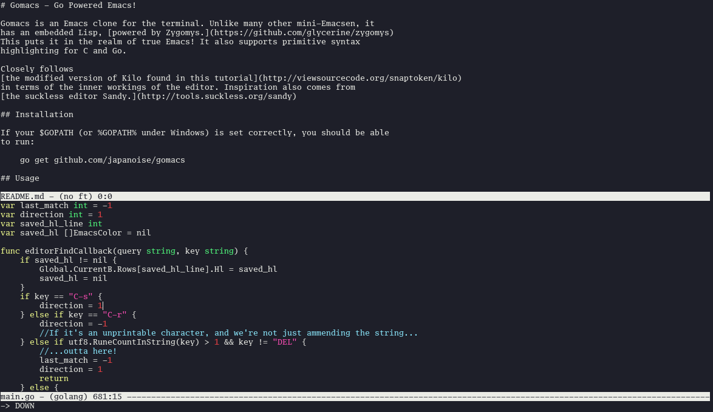

[](https://travis-ci.org/japanoise/gomacs)
[](https://codecov.io/gh/japanoise/gomacs)
[](https://goreportcard.com/report/github.com/japanoise/gomacs)

# Gomacs - Go Powered Emacs!



Gomacs is an Emacs clone for the terminal. Unlike many other mini-Emacsen, it
has an embedded Lisp, [powered by Glisp.](https://github.com/zhemao/glisp)
This puts it in the realm of true Emacs! It also supports syntax highlighting
for a wide array of languages; see the `syntax-files/` directory.

Closely follows
[the modified version of Kilo found in this tutorial](http://viewsourcecode.org/snaptoken/kilo)
in terms of the inner workings of the editor. Inspiration also comes from
[the suckless editor Sandy.](http://tools.suckless.org/sandy)

## Installation

If your $GOPATH (or %GOPATH% under Windows) is set correctly, you should be able
to run:

	go get github.com/japanoise/gomacs

If you want to install gomacs systemwide, make sure you set your gopath and that
this directory resides within it: here's an incantation that will do that on
Linux if you're not sure how:

```shell
# Set gopath and create directories
export GOPATH="$HOME/go"
mkdir -pv "$GOPATH"
# Create directory for this repo to live
mkdir -pv "${GOPATH}/src/github.com/japanoise"
cd "${GOPATH}/src/github.com/japanoise"
# Clone the repo
git clone https://github.com/japanoise/gomacs
cd gomacs
```

The makefile includes `install` which will install the program as `gomacs`, and
also `install-em` which will install it as `em` - in case your fingers are used
to uemacs. Both come with corresponding `uninstall` targets. The makefile also
accepts `PREFIX`, `DESTDIR`, `MANDIR`, etc.

## Usage

	gomacs [options] file

### Options

- `-s` - Disable syntax highlighting
- `-d` - Enable dumping of crash logs
- `-D` - Dump the keybindings to stdout and exit immediately. Used to generate
  the man page.

## Keybindings

Gomacs uses the standard Emacs keybindings. Of course, not all are implemented
yet - I'll try to keep this list up to date!

### Basics

- `C-g` - Cancel an action/keybinding/whatever
- `C-x C-c` - Save buffers and quit
- `C-x C-s` - Save buffer
- `C-_` - Undo (`C-/` also works)
- `C-x C-_` - Redo (`C-x C-/` also works) - press `C-_` or `C-/` again to redo
  more actions
- `C-z` - Suspend Gomacs (Linux only)
- `M-x` - Run named command
- `<f12>` - Panic key - quit emacs immediately without saving changes. Useful if
  Glisp falls down (which may happen if you do a lot of hacking on the editor's
  internals)

### Getting help

- `<f1>` - Quickhelp
- `C-h a` - Apropos - search for a named command
- `C-h b` - Show key bindings
- `C-h c` - Describe keybinding briefly
- `C-h m` - Show modes active in buffer

### File operations

- `C-x C-f` - find file
- `C-x d` - find file using dired-mode
- `C-x C-w` - write file
- `C-x C-v` - visit new file

### View operations

- `C-x b` - switch buffer
- `C-x k` - kill buffer
- `C-x 2` - open a new window
- `C-x o` - switch to other window
- `C-x 0` - delete selected window
- `C-x 1` - maximise selected window (deleting the others)
- `C-x 4 0` - delete selected window and current buffer
- `C-x 4 C-f` - find file in other window (creating one if there's only one window)
- `C-x 4 d` - use dired-mode to find file in other window
- `C-x 4 b` - switch buffer in other window
- `C-x 4 C-o` - display buffer in other window (keeping current window focused)
- `C-l` - Centre view on current line

### Cursor, navigation, search & replace

- `C-f` or `RIGHT` - Move cursor forward one character
- `M-f` - Move cursor forward one word
- `C-b` or `LEFT` - Move cursor backward one character
- `M-b` - Move cursor backward one word
- `C-p` or `UP` - Move cursor to previous line
- `C-n` or `DOWN` - Move cursor to next line
- `M-{` - Go backward a paragraph
- `M-}` - Go forward a paragraph
- `C-v` or `next` (Page Down) - Move cursor forward a screen
- `M-v` or `prior` (Page Up) - Move cursor backward a screen
- `C-M-v` - Move cursor forward a screen in other window
- `C-M-z` - Move cursor backward a screen in other window
- `C-s` - Incremental search
- `M-%` - Query replace
- `M-x replace-string` - Replace all instances of a string
- `M-x query-replace-regexp` - Query replace matches of a regular expression
- `M-x replace-regexp` - Replace all matches of a regular expression
- `M-<` - Go to start of buffer
- `M->` - Go to end of buffer
- `M-g g` or `M-g M-g` - Go to line (prompt)
- `M-g c` - Go to char (prompt)
- `C-x =` - Print location of cursor & information about the character at the
  cursor.
- `C-x r t` - Replace rectangle with string

### Deletion and Transposition

- `M-l` - Lowercase forward word
- `M-u` - Uppercase forward word
- `M-c` - Capitalize forward word
- `C-d` or `deletechar` - Delete forwards
- `backspace` - Delete backwards
- `M-d` - Delete forward word
- `M-<backspace>` or `M-D` (Meta-Shift-D) - delete backward word (`M-<deletechar>`
  does not work due to a fault either in Termbox or my terminal. If it works in
  your terminal, feel free to bind it.)
- `C-k` - Delete to end of line
- `M-z` - Zap (delete everything until) given character
- `M-q` - Fill paragraph or region (justify it to the width of the fill column)
- `M-x fill-region` - Fill region
- `C-x f` - Set the fill column
- `C-t` - Transpose (swap) characters at point
- `M-t` - Transpose (swap) words at point

### Region operations

- `C-@` - Set Mark (`C-<space>` also works)
- `C-x C-x` - Swap mark and cursor location
- `C-w` - Kill (cut) region between mark and cursor
- `M-w` - Copy region between mark and cursor
- `C-y` - Yank (paste) previously copied or killed region
- `C-x C-u` - Uppercase region
- `C-x C-l` - Lowercase region
- `C-x r M-w` - Copy rectangle to clipboard
- `C-x r k` or `C-x r C-w` - Kill rectangle
- `C-x r y` - Yank rectangle

### Registers

- `C-x r s` - Save region to register
- `C-x r i` - Insert saved region or rectangle from register
- `C-x r C-@` - Save position to register
- `C-x C-k x` - Save macro to register
- `C-x r j` - Jump to saved position or run saved macro from register
- `M-x view-register` - Describe a given register
- `C-x r r` - Save rectangle to register

### Misc

- `C-x (` - Start recording a macro
- `C-x )` - Stop recording a macro
- `C-x e` - Stop recording a macro and execute it (repeat by pressing `e`)
- `C-j` - Insert a newline and indent the new row
- `C-q` - Interpret the next keystroke literally and insert it (so you can enter
  escape sequences)
- `C-u` - Universal argument
- `C-x z` - Repeat previous command - press `z` to repeat again
- `M-x tabify` - Convert spaces to tabs using the tabsize set in the options
- `M-x untabify` - Convert tabs to spaces using the tabsize set in the options
- `M-~` - Clear the 'modified' flag, as if the buffer was just saved.
- `M-!` - Run shell command (add a universal argument to output to buffer)
- `M-|` - Run shell command on region (add a universal argument to replace
  region with output)
- `M-/` - Auto-complete

## Customization

Emacs loads from ~/.gomacs.lisp on startup and executes the content of this file.
Check out the Glisp documentation for information on how the language works!
Some functions to get you started…

- `(emacsbindkey arg1 arg2..)` - Bind arg1 (in standard Emacs C-\*/M-\* notation,
  subsequent keypresses space seperated) to the Lisp function or named command
  arg2. arg1 must be a string; arg2 can be a function or a string. If arg2 is a
  function, any additional args will be used as its arguments when run.
- `(emacsdefinecmd arg1 arg2..)` - Define a command with name arg1 that runs the
  function arg2 with any aditional arguments as its arguments. arg1 must be a
  string; arg2 must be a function.
- `(setsofttab arg)` - Enable (true) or disable (false) the use of soft tabs
  (spaces for indentation). arg must be a boolean.
- `(settabstop arg)` - Set the width of \t characters in cells. If using soft
  tabs, this also sets the number of spaces that will be inserted when you press
  the Tab key. arg must be an integer.
- `(gettabstr)` - returns what the Tab key inserts, either "\t" or some number
  of spaces.
- `(disablesyntax arg)` - Enable (false) or disable (true) syntax highlighting.
  arg must be a boolean.
- `(addhook mode func)` - Add a hook function `func` to the major mode `mode`.
  `mode` must be a string; `func` must be a function.

## Minor Modes

Each buffer has a number of minor modes activated. When a new buffer is opened,
the modes are copied from the "default" set. Modes are added to this set with
the lisp function `(adddefaultmode <mode>)` and removed with the function
`(remdefaultmode <mode>)`. They can be toggled with the command `toggle-mode`,
and you can view the current buffer's activated modes with the `show-modes`
command. Here's what each mode does:

- `terminal-title-mode` - use an escape sequence to set the terminal title.
- `line-number-mode` - display line numbers on the left edge of the buffer.
- `auto-indent-mode` - copy indentation from previous line when inserting a
  newline.
- `auto-fill-mode` - automatically fill (wrap) the current paragraph to
  `fill-column` characters (default 80, change with `C-x f`) when inserting a
  space.
- `tilde-mode` - draw `vi`-style blue tildes on lines outside the file
- `xsel-jump-to-cursor-mode` - jump to the mouse cursor position before pasting
  from the X selection

## Why?

I wanted an emacs to run in my terminal when Real Emacs wasn't an option.
Other terminal based Emacsen are available, but they each have their problems:

- mg doesn't do unicode.
- uemacs is effectively unmaintained (except for a patch from Torvalds once
  every few years) and lacks undo.
- godit is good, but not hackable. Furthermore, while I appreciate the
  "religious" approach in principle, in practice I like being able to customize
  my editor.
- sandy is too suckless-y. They build good components, but their tools often
  lack completeness. Plus it doesn't *really* use Emacs bindings, but
  emacs-like bindings, ala bash or zsh's "emacs mode". It's also unmaintained.

Furthermore, apart from sandy, none of these editors support syntax highlighting.

Finally, and most importantly, it's a fun project I've always wanted to do ;)

## Contributing

I welcome issues and pull requests. I'd love to have a partner or team to work
on Gomacs with me.

Gomacs contributors should be (in rough order of importance):

1. Kind and reasonable
2. Competent with Golang or willing to learn
3. Able and willing to chat with or contact me outside of GitHub
4. Enthusiastic about improving Gomacs and/or the ersatz-emacs landscape

## Credits

Thanks to nsf for termbox and godit (from which the suspend code comes.)

Thanks to zyedidia and the rest of the micro team for the syntax highlighting
code; see the LICENSE file for their full credits + copyright notice.
